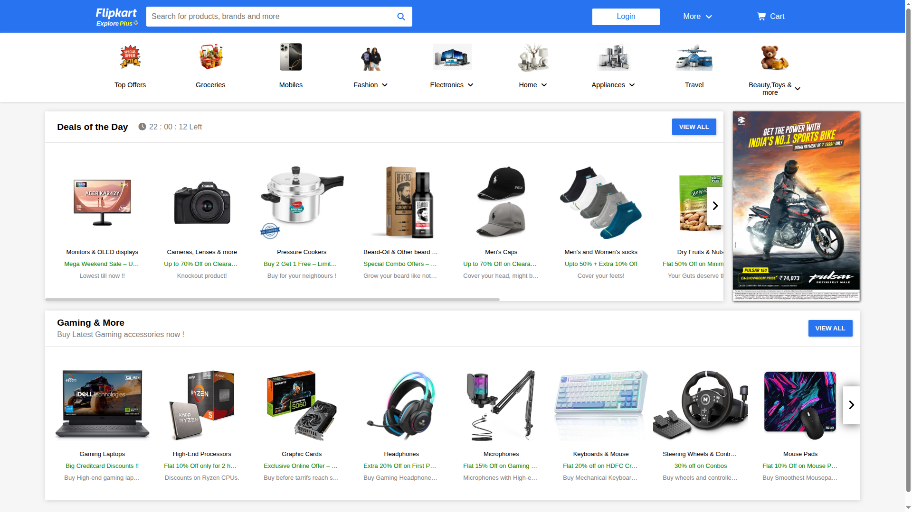
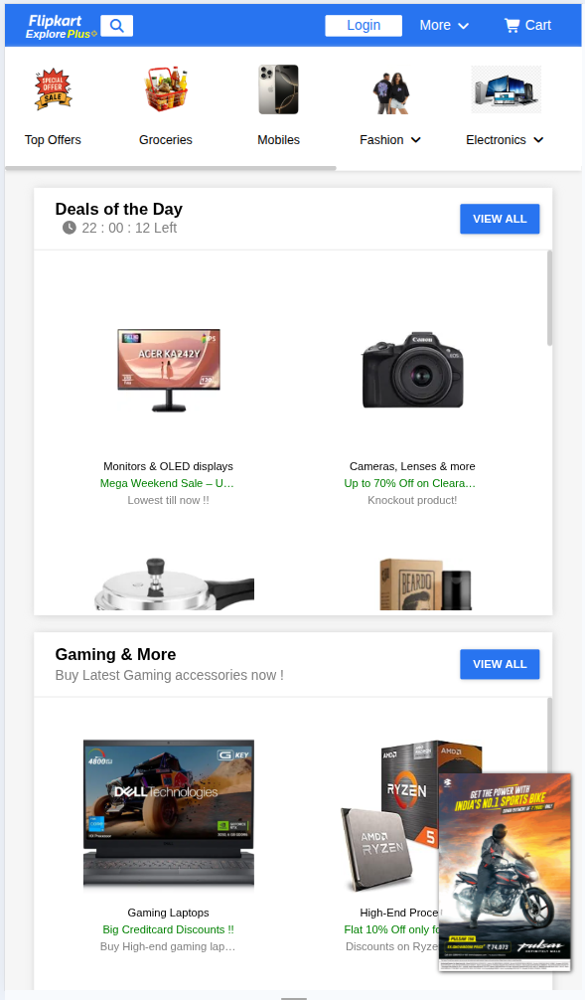
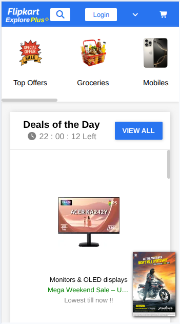

# Responsive E-Commerce Page Assessment

## Overview

This project is a responsive e-commerce website built with HTML and CSS. It demonstrates modern web design principles with a focus on responsiveness and user experience.

## Folder Structure

```
html_css_assessment/
├── index.html
├── styles.css
├── images/
├── screenshots/
└── README.md
```

## How to Run

1. Clone or download the project folder

```
   git clone https://github.com/jaimin-dekavadiya-simform/html_css_assessment
```

2. Open `index.html` in your web browser<br>
   `OR` <br>
   Run html file with Live-Server (extension) on VS-code
3. No installation or server required

## Screenshots

### Desktop View



### Tablet View



### Mobile View



## Live Demo

[View Live Demo](https://jaimin-dekavadiya-simform.github.io/html_css_assessment/)

## Video Demonstration

[Watch Demo Video](https://simformsolutionspvtltd-my.sharepoint.com/:v:/g/personal/jaimin_dekavadiya_simformsolutions_com/IQBRfZBaorpxQ6jhn8LJmHg5AcGYvPafKg5o7kGxiaRnNvg?nav=eyJyZWZlcnJhbEluZm8iOnsicmVmZXJyYWxBcHAiOiJPbmVEcml2ZUZvckJ1c2luZXNzIiwicmVmZXJyYWxBcHBQbGF0Zm9ybSI6IldlYiIsInJlZmVycmFsTW9kZSI6InZpZXciLCJyZWZlcnJhbFZpZXciOiJNeUZpbGVzTGlua0NvcHkifX0&email=dharmit.s%40simformsolutions.com&e=CawALW)

## What I Learned

- Semantic HTML structure
- CSS Flexbox and Grid layouts
- Responsive design
- CSS media queries
- Cross-browser compatibility
- Accessibility best practices

## Technologies Used

- HTML5
- CSS3
- Responsive Design Techniques

---
